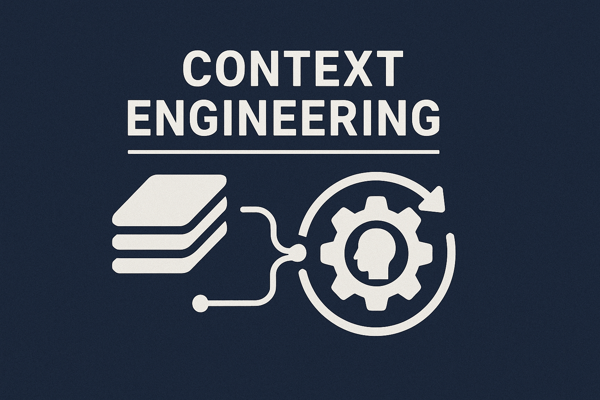

# Context Engineering

This repository is an experimental approach to software engineering with agents' help
based on the Context Engineering principle. This approach works for
[Claude Code](https://docs.anthropic.com/en/docs/claude-code/overview) as well as
[Github Copilot in Visual Studio Code](https://code.visualstudio.com/docs/copilot/overview).

## What is context engineering?

If you've worked with GitHub Copilot or other coding agents before, you may have noticed
that getting the agent to write the code you want takes quite some effort. At first, you
may get the correct result, but the agent starts misbehaving after a while.

Coding agents work better with the correct information. Building the proper context for
a coding agent that contains all the necessary information is called context
engineering.

Context engineering is a systematic approach to optimizing AI agent performance in
software development tasks by strategically curating and structuring the information
provided to the agent. Rather than giving agents brief, ad-hoc instructions, context
engineering emphasizes deliberate preparation of a comprehensive context that enables
agents to produce higher-quality, more consistent results.

### Core Principles

The Context engineering approach in this repository is based on a few core principles:

- Layered Context Architecture
- Research-Driven Plan Generation
- Self-Validating Workflows

#### Layered Context Architecture

project we're working on. For example, we need to teach about the architecture,
To improve the quality of an agent's output, we need to give it many details about the
documentation, and testing process. We also need to tell it about specific patterns that
we used to solve problems in the solution.

Providing the agent with this knowledge, such as the fact that you're building a
DDD-based service, can often be done through custom instructions like a
`copilot-instructions.md` or a `CLAUDE.md` file in your project repository.

The remaining information is specific to the task and can be provided by the agent
prompt input, like the chat window in Visual Studio Code. However, this input is rather
small.

Therefore, in the approach documented in this repository, we use a special file called
`TASK.md` to describe the task we want to solve. We can then ask the agent to use the
content of the task file to perform a task.

#### Research-Driven Plan Generation

As detailed as tasks can be, we've found during testing that it's often not enough to
write code based on the task description alone. It helps to ask the agent for a detailed
implementation plan. To generate a detailed implementation plan, we give the agent a
specific prompt that combines the contents of `TASK.md` with instructions to come up
with an implementation plan based on an internet search and research in the codebase.

In the implementation plan generation prompt, we ask the agent to store the generated
plan in a markdown file so we can review the plan before requesting the agent to
implement it in the codebase. Reviewing this plan and fine-tuning it to your needs is
crucial, as it dramatically improves the quality of the output.

#### Self-validating Workflows

During testing, we found that asking the agent to verify its work is essential. The
prompts we use to generate and execute implementation plans promote self-validation in
the agent. Combining self-validation with a detailed plan increases the quality of the
result.

### Key Benefits

- **Higher Code Quality**: Agents have access to comprehensive context, including existing patterns, conventions, and architectural decisions
- **Documentation as a Byproduct**: Requirements documents serve as lasting project documentation
- **Reduced Iteration Cycles**: Well-researched context reduces the need for back-and-forth clarification
- **Consistency**: A Structured approach ensures consistent code quality across different features and team members

### Implementation Framework

This repository's approach provides concrete tools, including command templates for
plan generation (`/generate-plan`) and implementation (`/implement-plan`), along
with quality scoring mechanisms to assess the completeness of context before proceeding
with implementation.

You can choose between two variants, Claude Code, and Visual Studio Code. We're open to
adding other agents if people need support for them.

Context engineering represents a shift from prompt engineering to systematic context
curation, treating AI agents as collaborative team members who benefit from the same
thorough preparation and documentation that human developers require for complex tasks.

## Getting started

To help you get started with context engineering, I made this repository. I've created
two versions of my approach. One for
[Github Copilot in VSCode](https://code.visualstudio.com/docs/copilot/overview) and one
for [Claude Code](https://www.anthropic.com/claude-code)

Choose your own adventure:

1. [Github Copilot](./github-copilot/README.md)
2. [Claude Code](./claude-code/README.md)

## Feedback/Ideas

Have you used my templates and have ideas for improvement?
[Leave an issue in this repository](https://github.com/wmeints/context-engineering/issues)!
