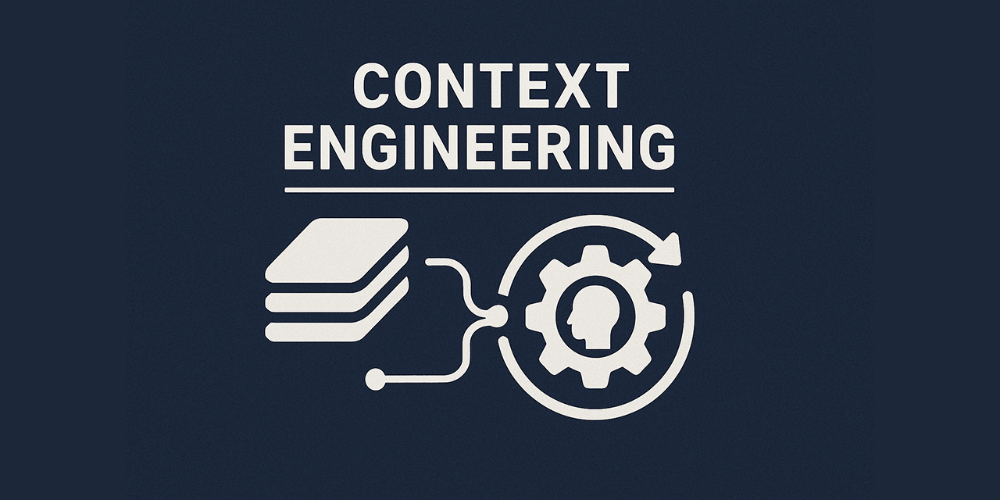

# Context Engineering

This repository is an experimental approach to software engineering with the help of
agents based on the principle of Context Engineering. This approach works for
[Claude Code](https://docs.anthropic.com/en/docs/claude-code/overview) as well as
[Github Copilot in Visual Studio Code](https://code.visualstudio.com/docs/copilot/overview).

**Important**: I'm still testing many things, but here's the initial
version of what I'm up to.

## What is context engineering?

Context engineering is a systematic methodology for optimizing AI agent performance in
software development tasks by strategically curating and structuring the information
provided to the agent. Rather than giving agents brief, ad-hoc instructions, context
engineering emphasizes deliberate preparation of comprehensive context that enables
agents to produce higher-quality, more consistent results.

### Core Principles

The core idea is to provide the coding agent with enough context information and the
right tools to write code for your solution effectively.

For example, if you're working on a new feature as part of a microservice that uses DDD
patterns, you'll want to explain to the agent that you're using DDD and what kind of
microservice you're building.

#### Layered Context Architecture

Providing the agent with knowledge like the fact that you're building a DDD based
service is generic to the whole project. So we start with a set of generic instructions
for the project you're working on. Depending on the kind of agent you're using you'll
need to write a `copilot-instructions.md` or a `CLAUDE.md` file to implement this
generic context for the agent.

Generic project information isn't enough to write code with an agent. If you want the
agent to be good at writing code for a specific task, you'll need to explain the details
of the task. Usually you'd write instructions for this in the chat window or in the
input prompt for the agent. But since we want a structured approach, we'll use a
dedicated file so we can write more detailed instructions. In this repo we use the
`TASK.md` to provide an in-depth explanation of what task we're working on.

#### Research-Driven Requirements Generation

As detailed as tasks can be, we've found during testing that it's often not enough to
write code based off just the task description alone. It helps to ask the agent for a
detailed implementation plan. To generate a detailed implementation plan, we give the
agent a specific prompt that combines the contents of `TASK.md` with instructions to
come up with an implementation plan based on internet search and research in the
codebase.

In the implementation plan generation prompt we ask the agent to store the generated
plan in a markdown file so we can review the plan before asking the agent to implement
it in the codebase. Reviewing this plan and fine-tuning it to your needs is important as
it greatly improves the quality of the output.

#### Self-validating Workflows

We found during testing that is important to ask the agent to verify its work. The
prompts that we use to generate and execute implementation plans promote self-validation
in the agent. This increases the quality of the end result.

### Key Benefits

- **Higher Code Quality**: Agents have access to comprehensive context including
  existing patterns, conventions, and architectural decisions
- **Documentation as a Byproduct**: Requirements documents serve as lasting project
  documentation
- **Reduced Iteration Cycles**: Well-researched context reduces the need for
  back-and-forth clarification
- **Consistency**: Structured approach ensures consistent code quality across different
  features and team members

### Implementation Framework

The methodology provides concrete tools including command templates for
requirements generation (`/generate-plan`) and
implementation (`/implement-plan`), along with quality scoring
mechanisms to assess the completeness of context before proceeding with
implementation.

Context engineering represents a shift from prompt engineering to systematic
context curation, treating AI agents as collaborative team members who benefit
from the same thorough preparation and documentation that human developers
require for complex tasks.

## Getting started

To help you get started with context engineering, I made this repository. I've created
two versions of my approach. One for
[Github Copilot in VSCode](https://code.visualstudio.com/docs/copilot/overview) and one
for [Claude Code](https://www.anthropic.com/claude-code)

Choose your own adventure:

1. [Github Copilot](./github-copilot/README.md)
2. [Claude Code](./claude-code/README.md)

## Feedback/Ideas

Have you used my templates and have improvement ideas?
[Leave an issue in this repository](https://github.com/wmeints/context-engineering/issues)!
